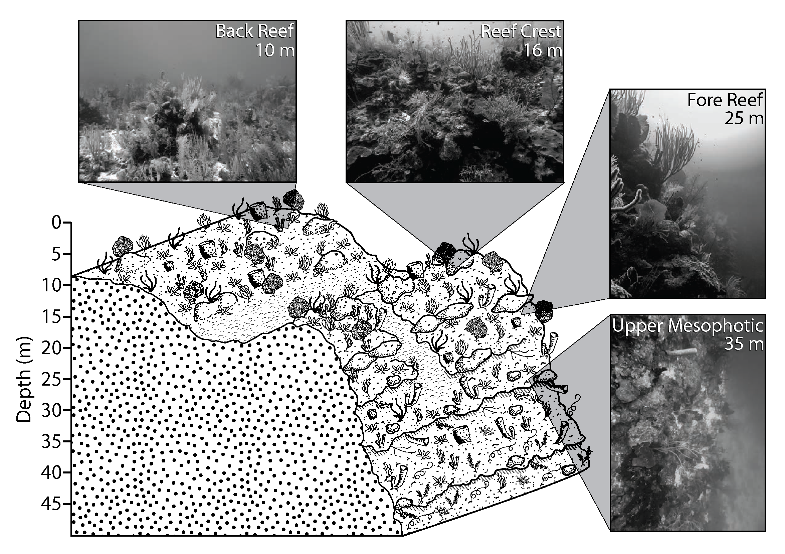
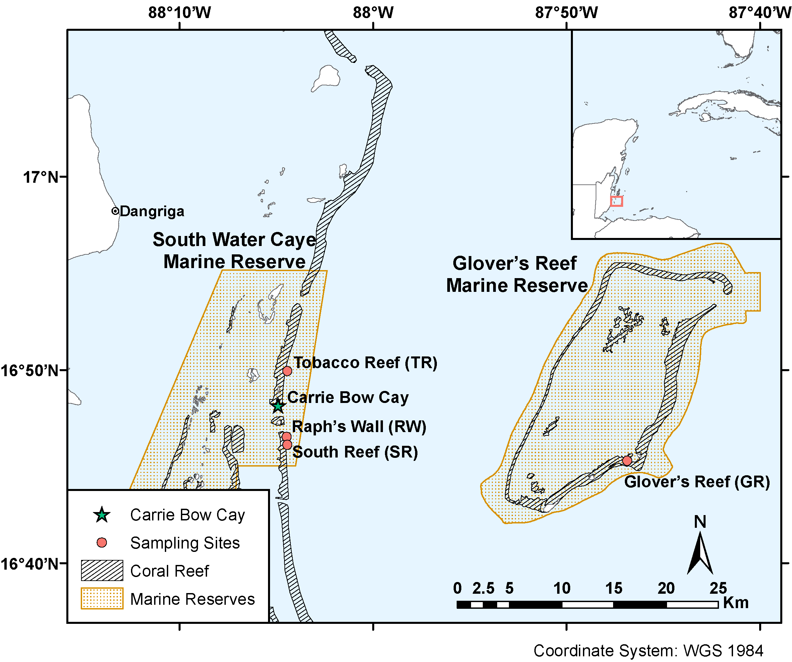

Symbiodiniaceae *ITS2* amplicon sequencing
==========================================

### Ryan Eckert -- <ryan.j.eckert@gmail.com>

### version: March 5, 2020

------------------------------------------------------------------------
This repository contains scripts and data associated with the
publication: 

**[Eckert RJ, Reaume AM, Sturm AB, Studivan MS and Voss JD (2020) Depth influences Symbiodiniaceae associations among *Montastraea cavernosa* corals on the Belize Barrier Reef. *Front. Microbiol.* 11:518. doi: 10.3389/fmicb.2020.00518](https://doi.org/10.3389/fmicb.2020.00518)**

------------------------------------------------------------------------
In Belize, shallow populations (10 and 16 m) of the coral species Montastraea cavernosa from the back reef and reef crest are genetically differentiated from deeper populations on the fore reef and reef wall (25 and 35 m). Like many species of scleractinian corals, M. cavernosa has an obligate symbiosis with dinoflagellate microalgae from the family Symbiodiniaceae. Here, we describe the Symbiodiniaceae taxa found within previously-sampled and genotyped M. cavernosa populations along a depth gradient on the Belize Barrier Reef by implementing high-throughput sequencing of the ITS2 region of Symbiodiniaceae ribosomal DNA and the SymPortal analysis framework. While Symbiodiniaceae ITS2 type profiles across all sampling depths were almost entirely (99.99%) from the genus Cladocopium (formerly Symbiodinium Clade C), shallow (10 and 16 m) populations had a greater diversity of ITS2 type profiles in comparison to deeper (25 and 35 m) populations. Permutational multivariate analysis of variance (PERMANOVA) confirmed significant differences in ITS2 type profiles between shallow and deep sample populations. Overall Symbiodiniaceae communities changed significantly with depth, following patterns similar to the coral host’s population genetic structure. Though physiological differences among species in the cosmopolitan genus Cladocopium are not well-described, our results suggest that although some members of Cladocopium are depth-generalists, shallow M. cavernosa populations in Belize may harbor shallow-specialized Symbiodiniaceae not found in deeper populations.

  

------------------------------------------------------------------------

Lab protocols adapted from [Meiog et
al. 2009](https://doi.org/10.1111/j.1755-0998.2008.02222.x); [Klepac et
al. 2013](https://doi.org/10.3354/meps11369).

------------------------------------------------------------------------

#### Protocols and walkthroughs accompanying this manuscript:

1.  [Protocol for DNA extraction and ITS2
    amplification](https://ryaneckert.github.io/Belize_Mcav_Symbiodiniaceae_ITS2/lab_protocol/)
2.  [Statistical analysis of sequencing
    reads](https://ryaneckert.github.io/Belize_Mcav_Symbiodiniaceae_ITS2/stats/)

------------------------------------------------------------------------

#### Repsitory contents:

- figures/
    - *Fig1.eps* -- Diagramatic representation of sampling depths (.eps)
    - *Fig1.png* -- Diagramatic representation of sampling depths (.png)
    - *Fig2.eps* -- Map of sampling sites (.eps)
    - *Fig2.png* -- Map of sampling sites (.png) 
    - *Fig3.eps* -- Barplot of *ITS2* sequences
    - *Fig4.eps* -- Barplot of *ITS2* type profiles
    - *Fig5.eps* -- nMDS plots of *ITS2* sequences and *ITS2* type profiles
    
- lab_protocol/
    - *barcodeMM.csv* -- Barcoding PCR mastermix recipe
    - *bcPCR.csv* -- Barcoding PCR profile
    - *bcPrimers.csv* -- Barcoding PCR primer sequence example
    - *ctab.csv* -- CTAB extraction buffer recipe
    - *etbrGel.csv* -- Ethidium bromide gel recipe
    - *index.html* -- Symbiodiniaceae lab prorocol webpage
    - *its2MM.csv* -- Symbiodiniaceae *ITS2* mastermix recipe
    - *its2PCR.csv* -- Symbiodiniaceae *ITS2* PCR profile
    - *its2Primers.csv* -- Symbiodiniaceae specific *ITS2* primer sequences
    - *reagents.csv* -- Reagent stock recipes
    - *supplies.csv* -- Supplies for CTAB extraction
    - *sybrGel.csv* -- SYBR gel recipe

- scripts/
    - *sampleRename.py* -- rename files based on a .csv table
    
- stats/
    - *62_20190310_DBV_2019-03-11_01-11-25.167036.profiles.absolute.clean.txt* -- *SymPortal* *ITS2* type profile absolute abundance output file cleaned for importing into R
    - *62_20190310_DBV_2019-03-11_01-11-25.167036.profiles.absolute.txt* -- *SymPortal* *ITS2* type profile absolute abundance output file
    - *62_20190310_DBV_2019-03-11_01-11-25.167036.profiles.relative.txt* -- *SymPortal* *ITS2* type profile relative abundance output file
    - *62_20190310_DBV_2019-03-11_01-11-25.167036.seqs.absolute.clean.txt* -- *SymPortal* *ITS2* sequence absolute abundance output file cleaned for importing into R
    - *62_20190310_DBV_2019-03-11_01-11-25.167036.seqs.absolute.txt* -- *SymPortal* *ITS2* sequence absolute abundance output file
    - *62_20190310_DBV_2019-03-11_01-11-25.167036.seqs.relative.txt* -- *SymPortal* *ITS2* sequence relative abundance output file
    - *CBC_MCAV_sampling_metadata.txt* -- *M. cavernosa* sample metadata
    - *Symbiodiniaceae_ITS2_statistical_analyses.Rmd* -- Symbiodiniaceae statistical analysis Rmarkdown document
    - *index.html* -- Symbiodiniaceae statistical analysis webpage
    - *its2Primer.pwk* -- PRIMER7 workbook
    - *stats.Rproj* -- R project file
    
- *CBC_MCAV_Symbiodiniaceae_ITS2_metadata.xlsx* -- *M. cavernosa* sample and library prep metadata
- *README.md* -- Repository readme document
- *Symbiodiniaceae_ITS2_primers_PCR.xlsx* -- Symbiodiniaceae *ITS2* and barcoding primer sequences and PCR profiles
